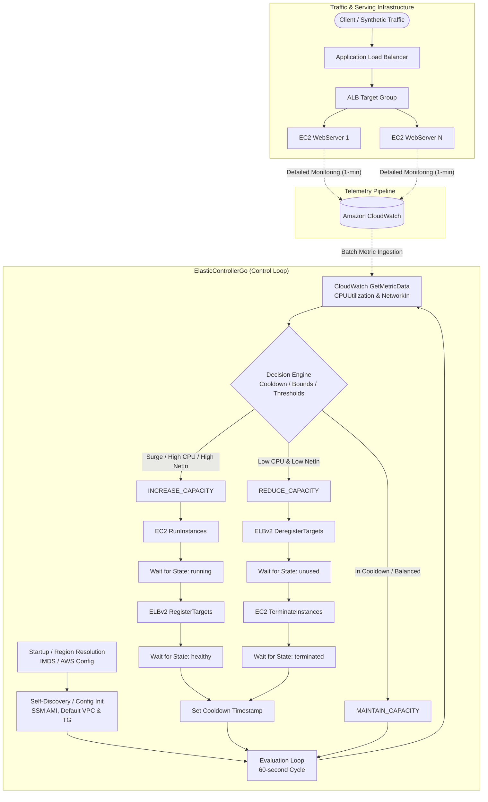
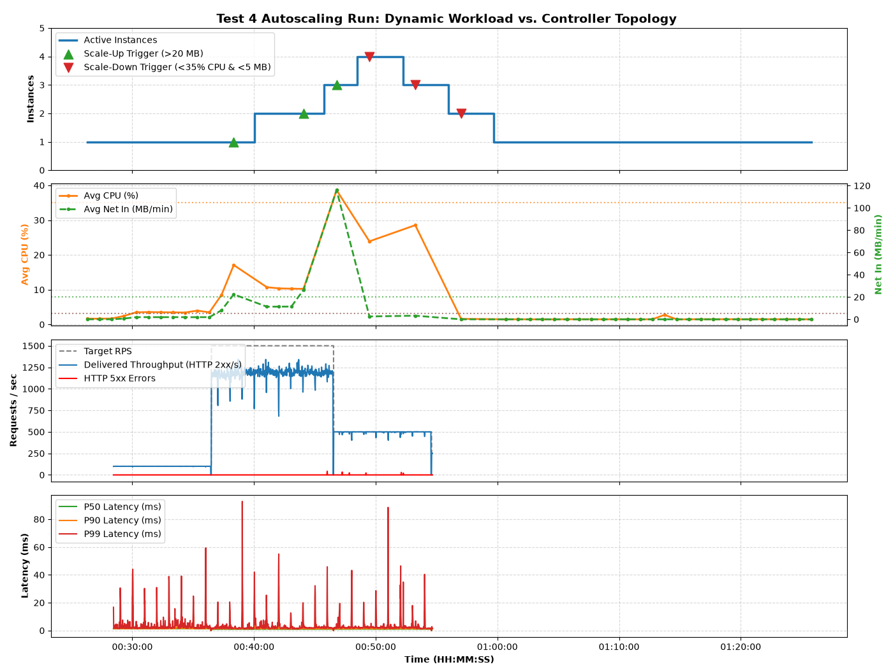

# ElasticControllerGo: Autonomous Cloud Elasticity Controller

[](https://golang.org)
[](https://github.com/aws/aws-sdk-go-v2)
[](https://github.com)

An autonomous horizontal auto-scaling controller and cloud evaluation engine implemented in Go using the **AWS SDK for Go v2** (`github.com/aws/aws-sdk-go-v2`).

`ElasticControllerGo` continuously monitors cluster telemetry via Amazon CloudWatch, calculates sliding-window workload gradients, and orchestrates horizontal scale-out and scale-in lifecycle actions across Amazon EC2 instances registered to an Application Load Balancer (ALB) Target Group.

---

## Table of Contents

- [System Architecture](#system-architecture)
- [Key Features](#key-features)
- [Threshold Parameters & Decision Matrix](#threshold-parameters--decision-matrix)
- [Instance Lifecycle & Safety Mechanisms](#instance-lifecycle--safety-mechanisms)
- [Prerequisites & AWS Setup](#prerequisites--aws-setup)
  - [IAM Policy Requirements](#iam-policy-requirements)
  - [Credential Configuration](#credential-configuration)
- [Configuration Reference](#configuration-reference)
  - [CLI Flags](#cli-flags)
  - [Configuration File Schema (`config.json`)](#configuration-file-schema-configjson)
  - [Detailed Field Descriptions](#detailed-field-descriptions)
  - [In-Place Defaults & Configuration Persistence](#in-place-defaults--configuration-persistence)
  - [Automatic Parameter Discovery & Self-Healing](#automatic-parameter-discovery--self-healing)
- [Pre-Built Binaries & Local Compilation](#pre-built-binaries--local-compilation)
  - [Pre-Built Production Binaries (`AppBuilds/`)](#pre-built-production-binaries-appbuilds)
  - [Native Windows Build](#native-windows-build)
  - [Cross-Compiling for Linux AMD64 from Windows](#cross-compiling-for-linux-amd64-from-windows)
  - [Native Linux / macOS Build](#native-linux--macos-build)
- [Linux Deployment as a Systemd Service](#linux-deployment-as-a-systemd-service)
  - [1. Provision Server Directory and Binary](#1-provision-server-directory-and-binary)
  - [2. Configure Server Configuration File](#2-configure-server-configuration-file)
  - [3. Create Systemd Service Unit](#3-create-systemd-service-unit)
  - [4. Service Management & Operations](#4-service-management--operations)
  - [5. Monitoring Logs](#5-monitoring-logs)
- [Load Testing & Benchmarking (`RealTrafficTest.go`)](#load-testing--benchmarking-realtraffictestgo)
  - [Traffic Phases](#traffic-phases)
  - [Running the Load Test](#running-the-load-test)
- [Experimental Results](#experimental-results)

---

## System Architecture

The elasticity controller runs as an out-of-band supervisory control loop that decouples telemetry ingestion, metric analysis, and lifecycle orchestration from the underlying application instances:



---

## Key Features

- **Multi-Metric Telemetry Fusion**: Evaluates both compute pressure (`CPUUtilization`) and network bandwidth throughput (`NetworkIn`) using AWS CloudWatch batch queries (`GetMetricData`).
- **Trend-Aware Scaling**: Detects rate-of-change deltas ($\Delta \text{CPU}$) over sliding windows to respond to sudden traffic surges before saturation occurs.
- **Dynamic Configuration & Self-Healing**:
  - Automatically queries AWS Systems Manager (SSM) Parameter Store to fetch the latest stable Ubuntu 24.04 LTS AMI if not explicitly configured.
  - Automatically discovers the region's default VPC via `ec2:DescribeVpcs` if `VpcID` is not explicitly configured, persisting the resolved ID back to disk.
  - Automatically provisions a default Target Group within the target VPC if none is provided.
  - Supports optional explicit Subnet targeting (`SubnetID`) for VPC subnet isolation, defaulting to standard VPC subnet assignment when omitted.
  - Detects the current AWS Region dynamically via EC2 Instance Metadata Service (IMDSv2) when running on AWS infrastructure.
  - In-place unmarshaling merges user-defined keys over default settings and persists the complete, resolved configuration back to disk.
- **Graceful Lifecycle Coordination**:
  - **Scale-Out**: Launches EC2 instance $\rightarrow$ Polls for `running` state $\rightarrow$ Registers target to ALB $\rightarrow$ Awaits target health status `healthy` before releasing cooldown.
  - **Scale-In**: Deregisters target from ALB $\rightarrow$ Awaits target drain state `unused` $\rightarrow$ Terminates EC2 instance $\rightarrow$ Awaits termination via AWS SDK waiters.
- **Flapping and Oscillation Protection**: Enforces a configurable cooldown period (`LookbackWindowMinutes`, default 2 minutes) after any scaling operation to allow CloudWatch metrics to stabilize.
- **Capacity Bounds Enforcement**: Strict upper (`MaxInstances = 5`) and lower (`MinInstances = 1`) limits with automatic fallback safeguard if all instances fail or drop to 0.
- **Dual-Sink Logging**: Simultaneously outputs formatted telemetry and diagnostic events to standard output and a designated log file (`controller.log`) via `io.MultiWriter`.
- **High-Throughput Synthetic Load Generator (`RealTrafficTest.go`)**: Multi-phase open-loop HTTP load generator measuring $P50$, $P90$, $P99$ latencies, HTTP status codes, and connection dynamics into structured CSV output.

---

## Threshold Parameters & Decision Matrix

The controller runs on a 60-second cycle. It extracts the current metric point (index 0) and previous metric point (index 1) across all managed instances matching the specified tag (`InstanceTag = "WebServer"`).

| Parameter | Configuration Key | Default Value | Description |
| :--- | :--- | :--- | :--- |
| **Minimum Capacity** | `MinInstances` | `1` | Guaranteed cluster floor. |
| **Maximum Capacity** | `MaxInstances` | `5` | Cluster ceiling to prevent runaway cloud costs. |
| **Lookback Window** | `LookbackWindowMinutes` | `2` (minutes) | CloudWatch query window and post-scaling cooldown duration. |
| **Error Cooldown** | `ErrorCooldownSeconds` | `5` (seconds) | Backoff pause when encountering transient AWS API errors. |
| **Scale-Up CPU** | `AVGCPUIncreaseThreshold` | `70` (%) | Immediate scale-out when average CPU exceeds this threshold. |
| **Surge Delta CPU** | `CPUChangeIncreaseThreshold` | `10` (%) | Scale-out when $\Delta \text{CPU} > 10\%$ and average $\text{CPU} > 50\%$. |
| **Scale-Up Network** | `AVGNetInIncreaseThreshold` | `20` (MB/min) | Scale-out when average network ingress exceeds this rate. |
| **Scale-Down CPU** | `AVGCPUDecreaseThreshold` | `35` (%) | Dual-condition trigger for scale-in. |
| **Scale-Down Network** | `AVGNetInDecreaseThreshold` | `5` (MB/min) | Dual-condition trigger for scale-in. |

### Decision Logic Matrix

```text
1. Check Cooldown:
   IF (now - lastScaleTime) < LookbackWindow:
       MAINTAIN_CAPACITY (In cooldown)

2. Check Zero-Instance Failsafe:
   IF activeInstances == 0:
       INCREASE_CAPACITY (Emergency recovery to MinInstances)

3. Evaluate Scale-Out (if activeInstances < MaxInstances):
   IF avgCPU > AVGCPUIncreaseThreshold
   OR (cpuChangeDelta > CPUChangeIncreaseThreshold AND avgCPU > 50)
   OR avgNetInMB > AVGNetInIncreaseThreshold:
       INCREASE_CAPACITY

4. Evaluate Scale-In (if activeInstances > MinInstances):
   IF avgCPU < AVGCPUDecreaseThreshold AND avgNetInMB < AVGNetInDecreaseThreshold:
       REDUCE_CAPACITY (Deregister 1 instance, drain, and terminate)

5. Default:
   MAINTAIN_CAPACITY (Steady state or capacity boundaries hit)
```

---

## Instance Lifecycle & Safety Mechanisms

### Safe Scale-Out Flow (`INCREASE_CAPACITY`)

1. **Launch**: Dispatches `ec2.RunInstances` with configured AMI, instance type (`t2.micro`), Security Groups, KeyPair, user-data startup script, and `DetailedMonitoring` enabled.
2. **Instance Readiness**: Invokes `WaitForInstanceRunning`, querying `ec2.DescribeInstanceStatus` every 5 seconds until EC2 state is `running`.
3. **ALB Registration**: Calls `elasticloadbalancingv2.RegisterTargets` to add the instance ID to the Target Group.
4. **Health Check Convergence**: Invokes `WaitForTargetStateHealth`, polling `DescribeTargetHealth` until ALB reports `healthy`.
5. **Cooldown Activation**: Sets `lastScaleTime = time.Now()` to prevent duplicate scale events while CloudWatch metrics propagate.

### Graceful Scale-In Flow (`REDUCE_CAPACITY`)

1. **Target Selection**: Selects candidate instance(s) for scale-in (1 instance per event).
2. **Connection Draining (Deregistration)**: Calls `elasticloadbalancingv2.DeregisterTargets`.
3. **Drain Verification**: Invokes `WaitForTargetStateHealth` awaiting target state `unused` (ALB deregistration delay completes and active in-flight HTTP requests finish).
4. **Termination**: Calls `ec2.TerminateInstances`.
5. **Termination Waiter**: Utilizes AWS SDK `ec2.NewInstanceTerminatedWaiter` with a 3-minute deadline to verify the instance enters terminal state cleanly before releasing the loop.

---

## Prerequisites & AWS Setup

### 1. Go Runtime
Ensure you have **Go 1.22+** installed:
```bash
go version
```

### 2. IAM Policy Requirements
Whether running locally via AWS credentials or on an EC2 instance via an IAM Instance Profile, the execution identity requires the following minimum IAM permissions:

```json
{
  "Version": "2012-10-17",
  "Statement": [
    {
      "Sid": "EC2InstanceManagement",
      "Effect": "Allow",
      "Action": [
        "ec2:RunInstances",
        "ec2:DescribeInstances",
        "ec2:DescribeInstanceStatus",
        "ec2:TerminateInstances",
        "ec2:CreateTags",
        "ec2:DescribeVpcs"
      ],
      "Resource": "*"
    },
    {
      "Sid": "ELBv2TargetGroupManagement",
      "Effect": "Allow",
      "Action": [
        "elasticloadbalancing:RegisterTargets",
        "elasticloadbalancing:DeregisterTargets",
        "elasticloadbalancing:DescribeTargetHealth",
        "elasticloadbalancing:CreateTargetGroup",
        "elasticloadbalancing:DescribeTargetGroups"
      ],
      "Resource": "*"
    },
    {
      "Sid": "CloudWatchTelemetryIngestion",
      "Effect": "Allow",
      "Action": [
        "cloudwatch:GetMetricData"
      ],
      "Resource": "*"
    },
    {
      "Sid": "SSMParameterResolution",
      "Effect": "Allow",
      "Action": [
        "ssm:GetParameter"
      ],
      "Resource": "arn:aws:ssm:*:*:parameter/aws/service/canonical/ubuntu/server/24.04/stable/current/amd64/hvm/ebs-gp3/ami-id"
    }
  ]
}
```

### 3. Credential Configuration

#### Local Execution (Development / Testing)
Export credentials in your shell or use the AWS CLI profile:

**PowerShell (Windows):**
```powershell
$env:AWS_REGION="us-east-1"
$env:AWS_ACCESS_KEY_ID="<your-access-key>"
$env:AWS_SECRET_ACCESS_KEY="<your-secret-key>"
$env:AWS_SESSION_TOKEN="<your-session-token>" # if using AWS Academy / STS
```

**Bash (Linux / macOS):**
```bash
export AWS_REGION="us-east-1"
export AWS_ACCESS_KEY_ID="<your-access-key>"
export AWS_SECRET_ACCESS_KEY="<your-secret-key>"
export AWS_SESSION_TOKEN="<your-session-token>" # if using AWS Academy / STS
```

#### Production EC2 Execution (Recommended)
Attach an IAM Role with the permissions above directly to the EC2 host via an **IAM Instance Profile**. The AWS SDK for Go v2 automatically retrieves temporary credentials via IMDSv2 with no static keys required.

---

## Configuration Reference

### CLI Flags

The controller executable supports two command-line arguments:

```bash
./controller -conf <path-to-config-json> -log <path-to-log-file>
```

| Flag | Default | Description |
| :--- | :--- | :--- |
| `-conf` | `./config.json` | Path to JSON configuration file. If missing, defaults are populated and saved. |
| `-log` | `./controller.log` | Path to log file where logs are appended concurrently with standard output. |

### Configuration File Schema (`config.json`)

Example production `config.json`:

```json
{
  "TargetGroupARN": "arn:aws:elasticloadbalancing:us-east-1:123456789012:targetgroup/controllerTG/1234567890abcdef",
  "InstanceAMI": "ami-04b4f1a9cf54c11d0",
  "InstanceTag": "WebServer",
  "InstanceType": "t2.micro",
  "VpcID": "vpc-0123456789abcdef0",
  "SubnetID": "subnet-0123456789abcdef0",
  "ErrorCooldownSeconds": 5,
  "MaxInstances": 5,
  "MinInstances": 1,
  "InstanceKey": "vockey",
  "SecurityGroupIDs": [
    "sg-0123456789abcdef0"
  ],
  "LookbackWindowMinutes": 2,
  "AVGCPUIncreaseThreshold": 70,
  "AVGCPUDecreaseThreshold": 35,
  "CPUChangeIncreaseThreshold": 10,
  "AVGNetInIncreaseThreshold": 20,
  "AVGNetInDecreaseThreshold": 5
}
```

### Detailed Field Descriptions

- **`TargetGroupARN`** (*string*): The Amazon Resource Name (ARN) of the Application Load Balancer Target Group where instances are registered and monitored.
- **`InstanceAMI`** (*string*): The AMI ID used to launch worker instances.
- **`InstanceTag`** (*string*): The tag value assigned to the `Name` tag (`Name: <InstanceTag>`) for cluster identification and discovery.
- **`InstanceType`** (*string*): EC2 instance type (e.g., `t2.micro`).
- **`VpcID`** (*string*): The Virtual Private Cloud (VPC) ID (e.g., `vpc-0123456789abcdef0`) used to scope resources such as the auto-provisioned Target Group. If omitted or empty (`""`), the controller discovers and persists the region's default VPC ID.
- **`SubnetID`** (*string, optional*): The Subnet ID (e.g., `subnet-0123456789abcdef0`) used for worker instance placement during scale-out. If omitted or `null`, AWS EC2 automatically assigns instances to a default subnet within the target VPC.
- **`ErrorCooldownSeconds`** (*int*): Delay before retrying after a failed API interaction.
- **`MaxInstances`** (*int*): Upper scaling bound.
- **`MinInstances`** (*int*): Lower scaling bound.
- **`InstanceKey`** (*string*): EC2 KeyPair name for SSH access (e.g., `vockey`).
- **`SecurityGroupIDs`** (*[]string*): Array of Security Group IDs permitting HTTP (port 80) and SSH (port 22) traffic.
- **`LookbackWindowMinutes`** (*int*): Sliding window period for CloudWatch metric aggregation and cooldown duration.
- **`AVGCPUIncreaseThreshold`** (*int*): Average CPU percentage to trigger scale-out.
- **`AVGCPUDecreaseThreshold`** (*int*): Average CPU percentage below which scale-in may trigger.
- **`CPUChangeIncreaseThreshold`** (*int*): Rate-of-change delta percentage ($\Delta \text{CPU}$) triggering surge scale-out.
- **`AVGNetInIncreaseThreshold`** (*int*): Network ingress rate (MB/min) triggering scale-out.
- **`AVGNetInDecreaseThreshold`** (*int*): Network ingress rate (MB/min) below which scale-in may trigger.

### In-Place Defaults & Configuration Persistence

`ElasticControllerGo` features a zero-maintenance configuration state machine:
1. **Missing Configuration File**: If the config file does not exist, `LoadControllerConfig` falls back to `DefaultControllerConfig()`, allowing the startup bootstrap sequence to discover cloud resources and write a new `config.json` automatically.
2. **Partial Keys (In-Place Unmarshaling)**: If the user provides a `config.json` containing only a subset of fields (e.g., only modifying `MaxInstances` and `LookbackWindowMinutes`), Go unmarshals the JSON directly onto the default configuration struct. All unspecified keys retain their production defaults.
3. **Automatic Disk Persistence**: Immediately following successful unmarshaling or dynamic discovery, the complete configuration is marshaled with indentation and written back to disk (`SaveControllerConfig`).
4. **Resilient Failure Mode**: If the disk write fails (e.g., read-only filesystem or restricted permissions), the controller logs a warning and proceeds safely with the in-memory configuration without crashing.

### Automatic Parameter Discovery & Self-Healing

If values are omitted from `config.json`:
1. **Empty `InstanceAMI`**: The controller queries AWS Systems Manager (SSM) Parameter Store path `/aws/service/canonical/ubuntu/server/24.04/stable/current/amd64/hvm/ebs-gp3/ami-id` to retrieve the latest official Ubuntu 24.04 LTS AMI for the active region, and persists the discovered AMI ID into `config.json`.
2. **Empty `VpcID`**: The controller queries AWS via `ec2:DescribeVpcs` with the filter `is-default: true` to discover the region's default VPC, updates the in-memory configuration, and persists it into `config.json`.
3. **Empty `TargetGroupARN`**: Using the resolved `VpcID` (custom or default), the controller calls `elasticloadbalancing:CreateTargetGroup` to provision a new Target Group named `controllerTG` on HTTP port 80, and persists the new Target Group ARN into `config.json`.
4. **Omitted / Null `SubnetID`**: When `SubnetID` is `null` or omitted, EC2 automatically assigns newly launched instances to a default subnet within the target VPC. Setting an explicit Subnet ID places instances directly into the specified subnet.
5. **Empty Region**: When running on an EC2 instance without `$env:AWS_REGION` or `~/.aws/config`, the controller resolves the local region from the EC2 Instance Metadata Service (IMDSv2).

---

## Pre-Built Binaries & Local Compilation

### Pre-Built Production Binaries (`AppBuilds/`)

The repository contains pre-compiled, self-contained binaries ready for execution without requiring a local Go installation:

| Platform / Target OS | Controller Executable | Load Generator Executable |
| :--- | :--- | :--- |
| **Windows (AMD64)** | `AppBuilds/Windows/controller.exe` | `AppBuilds/Windows/RealTrafficTest.exe` |
| **Linux (AMD64)** | `AppBuilds/Linux/controller` | `AppBuilds/Linux/realtraffic` |

---

### Native Windows Build

Run inside the project root in PowerShell:

```powershell
# Build Controller
go build -o AppBuilds/Windows/controller.exe ControllerMain.go

# Build Load Generator
go build -o AppBuilds/Windows/RealTrafficTest.exe RealTrafficTest.go
```

To run locally on Windows:
```powershell
.\AppBuilds\Windows\controller.exe -conf .\config.json -log .\controller.log
```

---

### Cross-Compiling for Linux AMD64 from Windows

To compile standalone Linux binaries directly from a Windows development environment:

**PowerShell:**
```powershell
# Set target OS and Architecture
$env:GOOS = "linux"
$env:GOARCH = "amd64"

# Compile Controller and Traffic Generator for Linux
go build -o AppBuilds/Linux/controller ControllerMain.go
go build -o AppBuilds/Linux/realtraffic RealTrafficTest.go

# Reset environment variables back to native Windows
Remove-Item Env:\GOOS
Remove-Item Env:\GOARCH
```

**Git Bash / WSL:**
```bash
GOOS=linux GOARCH=amd64 go build -o AppBuilds/Linux/controller ControllerMain.go
GOOS=linux GOARCH=amd64 go build -o AppBuilds/Linux/realtraffic RealTrafficTest.go
```

---

### Native Linux / macOS Build

Run inside the project root on a Linux or macOS machine:

```bash
# Build Controller
go build -o AppBuilds/Linux/controller ControllerMain.go

# Build Load Generator
go build -o AppBuilds/Linux/realtraffic RealTrafficTest.go
```

To run locally on Linux:
```bash
./AppBuilds/Linux/controller -conf ./config.json -log ./controller.log
```

---

## Linux Deployment as a Systemd Service

Setting up `ElasticControllerGo` as a background `systemd` service ensures continuous operation, automatic reboot recovery, and structured logging.

### 1. Provision Server Directory and Binary

Connect to your Linux EC2 controller host via SSH:

```bash
# Create dedicated directory for the controller
sudo mkdir -p /opt/elastic-controller

# Set ownership to standard user (e.g., ubuntu or ec2-user)
sudo chown -R ubuntu:ubuntu /opt/elastic-controller
```

Transfer the Linux binary (`controller`) and your configuration from your local machine to the server:

```powershell
# Example SCP from local PowerShell:
scp -i ./labsuser.pem ./AppBuilds/Linux/controller ubuntu@<EC2-CONTROLLER-IP>:/opt/elastic-controller/controller
```

Make the binary executable on the Linux host:

```bash
chmod +x /opt/elastic-controller/controller
```

### 2. Configure Server Configuration File

Create `/opt/elastic-controller/config.json` with your cluster parameters:

```bash
cat << 'EOF' > /opt/elastic-controller/config.json
{
  "TargetGroupARN": "arn:aws:elasticloadbalancing:us-east-1:123456789012:targetgroup/controllerTG/1234567890abcdef",
  "InstanceAMI": "",
  "InstanceTag": "WebServer",
  "InstanceType": "t2.micro",
  "VpcID": "",
  "SubnetID": null,
  "ErrorCooldownSeconds": 5,
  "MaxInstances": 5,
  "MinInstances": 1,
  "InstanceKey": "vockey",
  "SecurityGroupIDs": [
    "sg-0123456789abcdef0"
  ],
  "LookbackWindowMinutes": 2,
  "AVGCPUIncreaseThreshold": 70,
  "AVGCPUDecreaseThreshold": 35,
  "CPUChangeIncreaseThreshold": 10,
  "AVGNetInIncreaseThreshold": 20,
  "AVGNetInDecreaseThreshold": 5
}
EOF
```

> [!TIP]
> If `InstanceAMI`, `VpcID`, or `TargetGroupARN` are left as `""` (or `SubnetID` as `null`), the controller will automatically discover/provision them on first start and update `config.json`. Ensure the user running the service has write permissions to `/opt/elastic-controller/config.json`.

### 3. Create Systemd Service Unit

Create the service file `/etc/systemd/system/elastic-controller.service`:

```bash
sudo nano /etc/systemd/system/elastic-controller.service
```

Paste the following service definition:

```ini
[Unit]
Description=ElasticControllerGo Autonomous Auto-Scaling Service
After=network-online.target
Wants=network-online.target

[Service]
Type=simple
User=ubuntu
Group=ubuntu
WorkingDirectory=/opt/elastic-controller
ExecStart=/opt/elastic-controller/controller -conf /opt/elastic-controller/config.json -log /opt/elastic-controller/controller.log

# Automatic restart on failure after 10 seconds
Restart=always
RestartSec=10

# Standard limits and output forwarding
LimitNOFILE=65535
StandardOutput=journal
StandardError=journal

# Optional: If not using IAM Instance Profile, pass AWS credentials here:
# Environment="AWS_REGION=us-east-1"
# Environment="AWS_ACCESS_KEY_ID=<your-access-key>"
# Environment="AWS_SECRET_ACCESS_KEY=<your-secret-key>"
# Environment="AWS_SESSION_TOKEN=<your-session-token>"

[Install]
WantedBy=multi-user.target
```

### 4. Service Management & Operations

Reload systemd to pick up the new unit, enable it to start on system boot, and start the service:

```bash
# Reload systemd daemon
sudo systemctl daemon-reload

# Enable service to run on boot
sudo systemctl enable elastic-controller

# Start the service immediately
sudo systemctl start elastic-controller

# Verify service status
sudo systemctl status elastic-controller
```

#### Operational Cheat Sheet

| Task | Command |
| :--- | :--- |
| **Check Status** | `sudo systemctl status elastic-controller` |
| **Restart Service** | `sudo systemctl restart elastic-controller` |
| **Stop Service** | `sudo systemctl stop elastic-controller` |
| **Disable Boot Autostart** | `sudo systemctl disable elastic-controller` |

### 5. Monitoring Logs

You can monitor the controller using either `journalctl` (systemd logs) or the application log file:

```bash
# Stream live logs via systemd
journalctl -u elastic-controller -f

# View live application log file
tail -f /opt/elastic-controller/controller.log
```

Expected startup output:
```text
Loop #1 started
Found 1 matching instances
1: Instance i-0123456789abcdef0 of type t2.micro, has state: running and TG state is: healthy
Lookback window: 2m0s, Period: 1min, Metrics:
AVG CPU: 14.2  CPU change: 0.8
AVG Net In (MB): 1.12  Net In change: 0.04
MAINTAIN_CAPACITY, Reason: Metrics in steady state (CPU: 14.2%, NetIn: 1.12 MB/min)
```

---

## Load Testing & Benchmarking (`RealTrafficTest.go`)

The included `RealTrafficTest.go` generates realistic traffic workloads using an open-loop model calibrated to CloudWatch collection intervals and EC2 bootstrap times.

### Traffic Phases

| Phase | Duration | Target RPS | Objective |
| :--- | :--- | :--- | :--- |
| **1. Baseline / Warm-up** | 8 min | 100 RPS | Validates baseline performance with minimum capacity (1 instance). |
| **2. Sudden Demand Spike** | 10 min | 1500 RPS | Induces compute & network saturation to force scale-out to maximum capacity (5 instances). |
| **3. Sustained High** | 8 min | 500 RPS | Tests stability and prevents flapping under continuous load. |
| **4. Traffic Cooldown** | 10 min | 250 RPS | Induces low resource utilization to trigger graceful scale-in back to baseline. |

### Running the Load Test

```bash
# On Linux
./AppBuilds/Linux/realtraffic -url "http://<YOUR-ALB-DNS-NAME>" -out "experiment_metrics.csv"

# On Windows
.\AppBuilds\Windows\RealTrafficTest.exe -url "http://<YOUR-ALB-DNS-NAME>" -out "experiment_metrics.csv"
```

Console status displays second-by-second throughput and latency percentiles:
```text
[14:05:01] Active:  150 | 2xx: 1498/s | 5xx:   0/s | Err:   0/s | Latency (p50:  12.4ms, p90:  28.1ms, p99:  54.2ms)
```

---

## Experimental Results

Experimental benchmarks demonstrate controller responsiveness under load:

<p align="center">
  
</p>

1. **Surge Reaction**: During Phase 2 (1500 RPS), CPU utilization rose above 70%, triggering successive scale-out events up to the 5-instance cap. P99 latency dropped significantly as newly registered healthy instances absorbed traffic.
2. **Stabilization**: In Phase 3, instances remained steady without thrashing or false-positive deregistration.
3. **Graceful Draining**: During Phase 4, traffic subsided, allowing CPU and Network metrics to drop below scale-down thresholds. Targets were cleanly drained without connection resets (`5xx = 0`), returning the cluster safely to minimum capacity.
